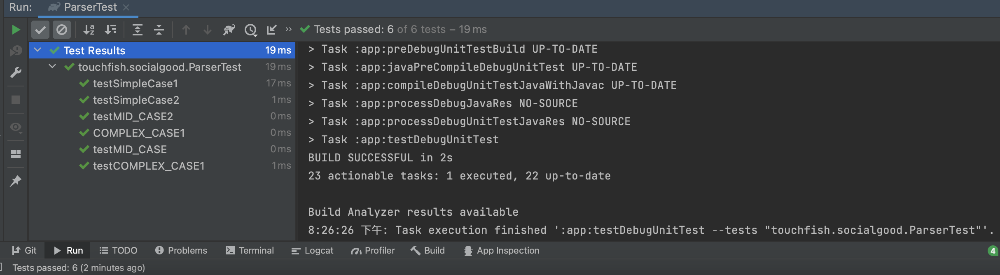

# TOUCH FISH Report

## Table of Contents

1. [Team Members and Roles](#team-members-and-roles)
2. [Summary of Individual Contributions](#summary-of-individual-contributions)
3. [Conflict Resolution Protocol](#conflict-resolution-protocol)
4. [Application Description](#application-description)
5. [Application UML](#application-uml)
6. [Application Design and Decisions](#application-design-and-decisions)
7. [Summary of Known Errors and Bugs](#summary-of-known-errors-and-bugs)
8. [Testing Summary](#testing-summary)
9. [Implemented Features](#implemented-features)
10. [Team Meetings](#team-meetings)

## Team Members and Roles

| UID        |     Name      |   Role |
| :--------- | :-----------: | -----: |
| [u7344524] |   Siyuan He   | leader |
| [u7244650] |  Siqi Cheng   | member |
| [u7349311] | Jialiang Chen | member |
| [u7345960] |    Yu Chan    | member |

## Summary of Individual Contributions

#### u7244650, Siqi Cheng,

*I contribute 25% of the code. Here are my contributions:*

* A. publishActivityActivity.java
* B. mineActivity.java
* C. publishGoodActivity.java
* D. UI Design
    * The design pattern was chosen in the first team meeting by all team members.
    * The design was first drafted by me and constructed to XML files with all members' effort.
* E. Slide preparation
* F. Report Writing
    * The main part of the report

#### u7344524, Siyuan He,

*I contribute 30% of the code. Here are my contributions:*

* A. HomeActivity.java
* B. ActivityActivity.java
* C. MineActivity.java
* D. PublishActivityActivity.java - part
  * Write data to Firebase
* E. LoginActivity.java - part
  * Read data from Firebase
* F. RegisterActivity.java - part
  * Write data to Firebase
* H. ActivityClass.java
* I. User.java
* J. Publisher.java
* K. Report Writing
  * Application UML

#### u7349311, Jialiang Chen,

*I contribute 25% of the code. Here are my contributions:*

* A. ShopActivity.java
* B. itemDetailActivity.java
* C. touchfish.socialgood.search all files
* D. activity_shop.xml
* E. ItemModel.java
* F. activity_item_detail.xml
* G. ParseTest.java
* H. Report Writing -part

#### u7345960, Yu Chang,

*I contribute 20% of the code. Here are my contributions:*

* A. LoginActivity.java
  * Check all inputs are valid from users or publishers.
  * Check email and password are matched from user's or publish's inputs.
* B. RegisterActivity.java
  * Check all inputs are valid from users or publishers.
  * Writing data from inputs to Firebase realtime database.
* C. Initialize Firebase
  * Gradle settings for google services and firebase.
  * Authenticating the client for app.
* D. Layout for Login & Layout for Register
* E. Reading data from Firebase
  * Reading data for users and publishers.
  * Reading data for shop items.
* F. Writing data to Firebase
  * Writing data for users and publishers.
  * Writing data for shop items. 
    

## Conflict Resolution Protocol

During completing this large project, plenty of issues were generated. There are 2 main ways for the team to dealing them. 

Firstly, a WeChat group chat was set up for dealing with these conflicts between team members. Since the project was distributed into several parts for group members to work on individually, every member could ask help or any question with another part of this project directly in this chat and get the response from a specific member. Other team members would solve most small problems like missing ids and class design quickly.

Besides, sometimes there would be some major problems such as getting trouble with function design or data storage and retrieval then an extra group meeting would hold. In the extra team meeting, all members would work on the conflicts and provide their idea for discussion. The meeting would eventually figure out a satisfying solution for everyone and the development could carry on.

The above are two methods we used for conflict resolution, it gave us a great boost in incorporation and development efficiency with these frequent checks and contacts. 

## Application Description

SocialGood is a social public benefit activity application targeting everyone who is willing to attend these public benefit activities. Besides, it also provides a template for public benefit organizations to get volunteers and advertise their activities. This app has a unique feature of a rewarding system, in which participants would get prizes with credits they earned by volunteering for other activities. We believed it could encourage more people to attend public benefit activities around them and start caring about these public benefit problems like vulnerable people and global environments.

**Application example**

Adam was worried about the global warming that happened recently and decided to contribute his strength to help

1. Adam use the app to look for the activity about global warming such as planting trees and get the information of it.
2. Adam clicks the like button to support the activity.
3. Adam uses the join-in button to follow this activity and he can quickly check it in his profile.
4. Adam attend this activity as scheduled and get a chance to meet other volunteers who shared similar ideas in the real world.

Bella was a manager of solving water pollution organization and she was troubled of lacking advertising for their activities for picking rubbish around river banks

1. Bella uses the app to publish their activity of picking rubbish for the river and set up basic information for it
2. Bella set up a little prize that their organization would like to provide like Commemorative badges.
3. Bella could receive likes from users who supported their activity.
4. During the scheduled day, all followers would attend this activity and contribute their strength to solving water pollution.

**Target Users**

*Targets User: Students*

* Users could find these activities hold by public benefits organizations and join them during their spare time.
* Users could meet professional organizations using this app and have chances to learn more about these activities.
* Users could find other users who attend this activity in real life.

*Targets User: speculator*

* Users who seek to get free prizes can work with these activities and earn their credits

* Users could get a better understanding of public problems they attended to and may make a change to their behavior in the future.

*Targets User: anyone who willing to care about public benefit*

  * Users who seek to contribute to better society
  * Users who would like to use their free time to do public benefit for fun.

*Target User: Organizers*

* Users could use this app to advertise their activity

* Users could encourage the public to pay more attention to their organization and business

  

## Application UML

## Application Design and Decisions

**Data Structures**

*I used the following data structures in my project:*

1. *ArrayList*

* *Objective: It is used for* getting the different features of users and publishers
* Locations: MineActivity.java, ShopActivity.java
* *Reasons:*
  * It could reuse the ListView for generating different features for a different types of users
  * It achieves the function of using one activity for different users
  * It is easy to extend the functionality in the future.

2. *JSON Tree*

* *Objective: It is used for users and publishers to register and login on to firebase, also working for reading and writing data for the whole app*
* *Locations: LoginActivity.java, RegisterActivity.java, HomeActivity.java, MineActivity.java, ActivityActivity.java, PublishProductActivity.java, PublishActivityActivity.java*
* *Reasons:*
  * Try to put all data on the firebase to reach the medium task.
  * Try to reach the Tree task, because firebase is a cloud-hosted JSON tree, when we add data to the JSON tree, it becomes a mode in the existing JSON structure with an associated key.

**Design Patterns**

* *Visitor*

  The visitor is a behavioral design pattern that lets you separate algorithms from the objects on which they operate. In this app, users and publishers are separated into two groups with different functions. It would be easy for adding or modifying functions to either of them but not break the whole data structure. This method saves time and space for dealing with two types of users in our app.

* *State*

  The state is a behavioral design pattern that lets an object alter its behavior when its internal state changes. It appears as if the object changed its class. In the profile, we only use one "mine button" to achieve two different profile types with different functions for the user and publisher. This simply reduces the complexity of designing two separate fragments for different users and make the development more organized.

* *Adapter*

  The adapter is a structural design pattern that enables objects with incompatible interfaces to cooperate with each other. In ShopActivity we have defined a new StoreAdapter that will display the desired effect in lisView. We designed the content to be displayed in item_model.xml. In ShopActivity we have defined a new StoreAdapter that will display the desired effect in lisView. We designed the content to be displayed in item_model.xml. Each item in the ListView is presented as the contents of item_model.xml.

* *Facade*

  The facade is a structural design pattern, which can provide a simple interface for program library, framework, or other complex classes. In our app, we provide a series of interfaces to help users and publishers with login and register, interact with activities and items, and view their personal information. Users and publishers can realize various functions through simple input and buttons.

* *Prototype*

  The prototype is a creative design pattern that lets you copy existing objects without making your code dependent on their classes. It is used when creating the UI. Most UIs could be similar for different content and this means we could use a prototype as a blueprint for other similar screens. For example, product detail and activity detail is similar to the layout in our app, so we just fill this similar layout with different data and save plenty of time while developing. 

**Grammar(s)**

**Tokenizer and Parsers**

* This parse is used to retrieve characters from the search box. The formula is as follows:
*
* [parseExp] ::= [wordExp]+[parseExp] | [wordExp] | [numExp] | [wordExp]+[numExp] | [numExp]+[wordExp]
* [wordExp] ::= [characterExp] | [characterExp]+[parseExp]
* [characterExp] ::= [charExp]
* [numExp] ::= [IntExp]
* Whatever information the user enters through this formula, the program can process.
* Currently only the numbers and characters entered by the user are retrieved,
* and more characters can be retrieved if needed.

**Surprise Item**

* We design the group logo display on the beginning of our app, which is a wonderful work of our group member Siqi Cheng.
* We had a great implement of firebase real-time storage that almost everything in our app is real-time updated with the cloud. It gives users a lot of flexibility when using the app. This feature was decided when we decided to move everything to the firebase and the real-time system is obviously the best choice. We design the data structure with separated groups and store images separately with a reference link. This makes the data on the firebase more organized and easy for extension in further development.
* Constraints on the content of input boxes when users register and log in to their accounts
* We have set up an area to display images circularly that can be used as a promotion for the activity
* The design of the bottom navigation bar

**Other**

We choose to use bottom navigation to switch UI among fragments, but we found the fragmented st structure leads to more issues in the function design. As a result, it took us a great effort to switch from fragment structure to activity structure. But we keep the design of the bottom navigation bar.

## Summary of Known Errors and Bugs

1. *Cannot show history:*
- cannot show what kinds of activities that user joined and credit changing

2. *Cannot show follow*
- cannot show which activities that user followed

## Testing Summary

*Number of test cases: 1*
*Code coverage: 10%*
*Types of tests created: tests tokenizer and parser*
*This test is used to test whether tokenizer and parser can be used normally and simulate the data entered by users in various situations. By testing the actual situation of the use of samples and programs. We think our tokenizer and parser work well*

## Implemented Features

***Greater Data Usage, Handling and Sophistication***

1. *Feature 1: Read data instances from multiple local files in different formats (JSON, XML, or Bespoken). (easy)*

   > we read XML file for the UI and read the JSON file on the firebase for the rest of the data.

2. *Feature 2: User profile activity containing a media file (image, animation (e.g. gif), video). (easy)*

   > The user could change their profile picture on the profile page. Besides, publishers could publish activity and product picture
//
3. *Feature 3: Report viewer. Provide users with the ability to see a report of interactions with your app (e.g., total views, total likes, total raised for a campaign, etc, in a graphical manner.(medium)*

   > User could check the activity they attended in the past on the profile-History page

**User Interactivity**

1. *Feature 1: The ability to micro-interact with items in your app (e.g. like/dislike/support/report) [stored in-memory].(easy)*

   > The user could like or dislike activities on the activity detail page
//
2. *Feature 2: The ability to 'follow' users, events, movements, hashtags,and  topics. There must be a section specifically dedicated to 'things' followed. [stored in memory]. (medium)*

   > The user could join in the activity if they would like to follow these topics. They could check what they are following on the profile-Followed page

***Firebase Integration***

1. *Feature 1: Use Firebase to implement user Authentication/Authorization. (easy)*

   > Our app uses firebase for the login and login

2. *Feature 2: Use Firebase to persist all data used in your app (this item replaces the requirement to retrieve data from a local file) (medium)*

   > Our app stores activity data, product data, and user data on the firebase

3. *Feature 3: Using Firebase or another remote database to store user information and having the app updated as the remote database is updated without restarting the application. E.g.User A makes a transfer, user B on a separate instance of the application sees user A's transfer appear on their app instance without restarting their application. (very hard)*

   > Our app supports the function that as soon as a publisher publishes something new, other users could see these items by simply refreshing the fragment.

## Team Meetings

- *[Team Meeting 1](Meetings/Meeting1.md)*
- *[Team Meeting 2](Meetings/Meeting2.md)*
- *[Team Meeting 3](Meetings/Meeting3.md)*
- *[Team Meeting 4](Meetings/Meeting4.md)*
- *[Team Meeting 5](Meetings/Meeting5.md)*
- *[Team Meeting 6](Meetings/Meeting6.md)*
- *[Team Meeting 7](Meetings/Meeting7.md)*
- *[Team Meeting 8](Meetings/Meeting8.md)*
- *[Team Meeting 9](Meetings/Meeting9.md)*
- *[Team Meeting 10](Meetings/Meeting10.md)*
